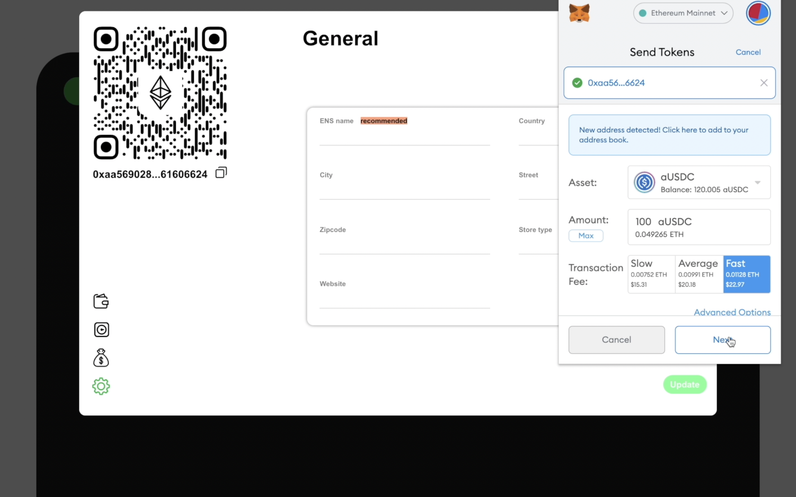
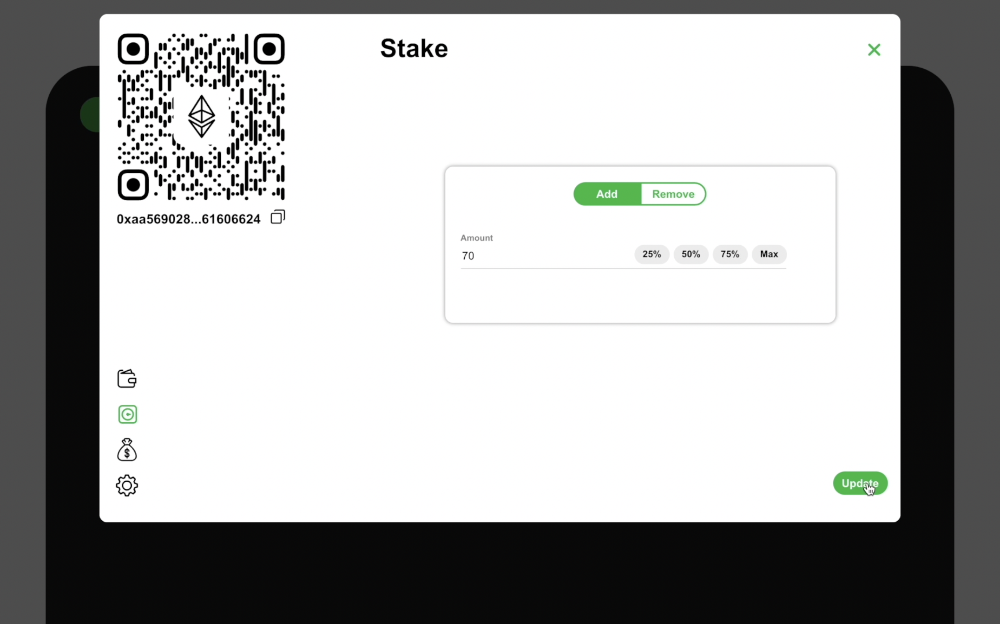
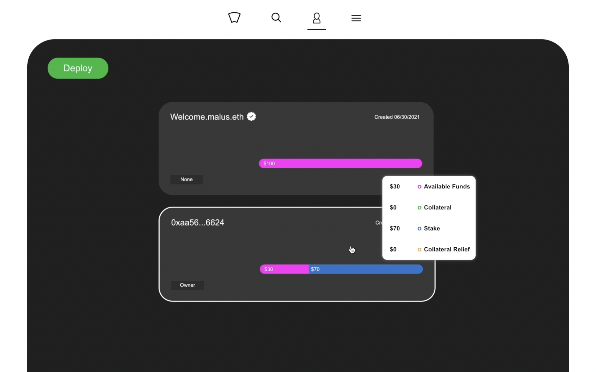

# Deploy, Stake, and Collect

This page is for users who are selling their goods and services and don't wish to give discounts. We will provide steps helping you setting a store to better help your customers.

### Step1

Make sure you are in the manage section of the application and click the deploy button.

###

### Step2

Once the store is deployed, we can hover over the store and observe that the available funds, collateral, stake, and collateral relief are all zero. We can proceed to click on the store. 

### Step3

Since this store has no money inside of it, we need to copy the wallet address which can be found under the qrcode. 

### Step4

We will now head over to our Metamask wallet and send 100 aUSDC to the store. 


Please note that you are sending V2 of Aave's aTokens to the store contract.


### Step5

Once the transaction is completed, we can head on over to the stake section of the store by clicking the second icon on the left. Next, we must ensure that the toggle is set to add. We will add 70 aUSDC as colleteral and click update.

### Step6

If we exit the store after the transaction, we can now observe that the store has 30 available funds and 70 stake. Since we have 70 aUSDC stake, we can accept up to 1000 USDC in payments.

