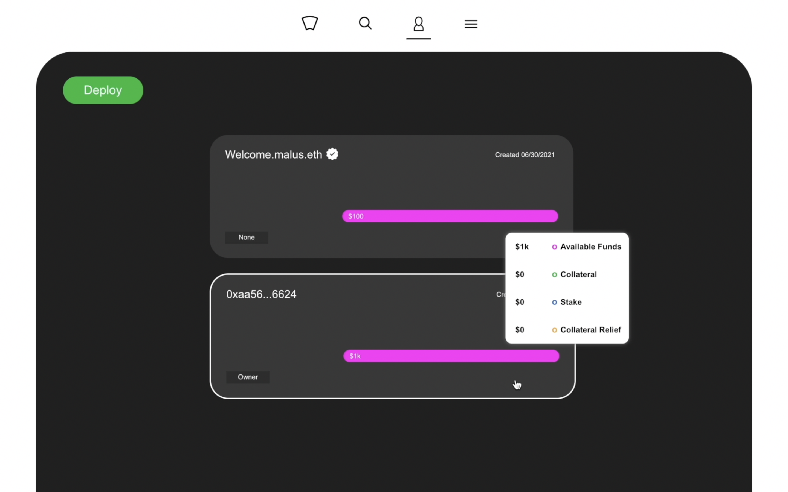
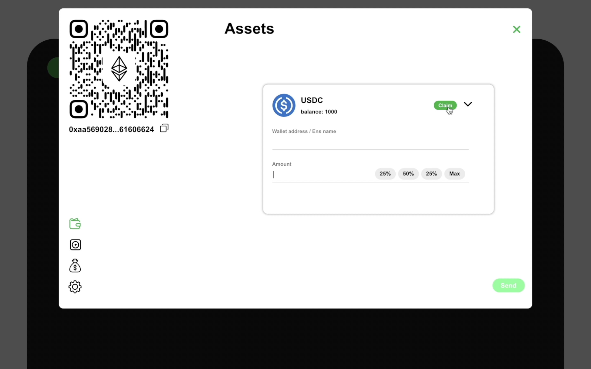
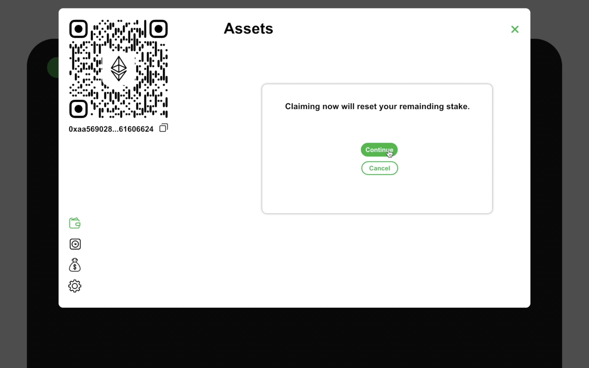
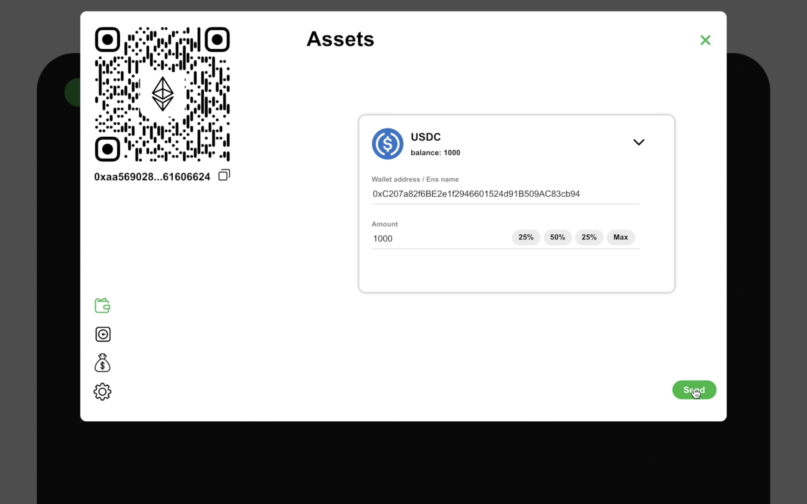
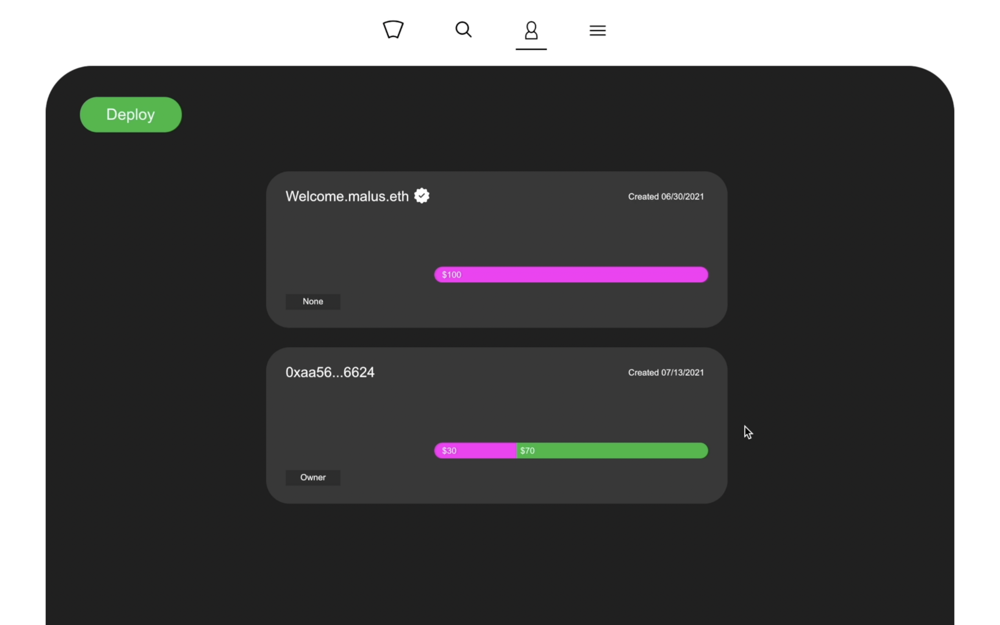

# Deploy, Stake, and Collect

This page is for users who are selling their goods and services and don't wish to give discounts. We will provide steps helping you setting a store to better help your customers.

### Step1

Make sure you are in the manage section of the application and click the deploy button.

###

### Step2

Once the store is deployed, we can hover over the store and observe that the available funds, collateral, stake, and collateral relief are all zero. We can proceed to click on the store. 

### Step3

Since this store has no money inside of it, we need to copy the wallet address which can be found under the qrcode. 

### Step4

We will now head over to our Metamask wallet and send 100 aUSDC to the store. 


Please note that you should only send V2 of Aave's aTokens to the store contract.


### Step5

Once the transaction is completed, we can head on over to the stake section of the store by clicking the second icon on the left. Next, we must ensure that the toggle is set to add. We will add 70 aUSDC as colleteral and click update.

### Step6

If we exit the store after the transaction, we can now observe that the store has 30 available funds and 70 stake. Since we have 70 aUSDC stake, we can accept up to 1000 USDC in payments.

### Step7

We now have received 1000 USDC in total payments and have used up our 70 aUSDC staked. We can proceed to click and open the store. 


Please note that even though we have 1k available funds, it is actually 1030 which includes 30 aUSDC and 1000 USDC. In addition, our 70 stake is now collateral. It will display on the store after we have claimed in the next step. 


### Step8

Once we have opened the store, we need to head to our assets by clicking on the first icon. After which, we must make sure we hit the drop down menu and select USDC. Usually, if you see a green claim button it means we have USDC in the Store hub. We will proceed to click the green button to claim our USDC. 


Sometimes we might not need to claim if the amount we are sending currently in the store and not the Store hub. 


### Step9

Now before we proceed we have the option to cancel the claim. We will click on continue and finish out claim.


Please note that if you claim before using up all your remaining stake, Your stake will be reset to zero and added back to your available funds. 


### Step10

Once we have claimed, we can proceed to send 1000 USDC to any personal wallet address we choose to. 

### Step11

When the transaction is completed, if you close your store, we can now observe that we have 30 available funds and 70 collateral. As stated before in Step7, once we have claimed the collateral now becomes visible in the store.


All the interest we will gain from our collateral will be added to our available funds. Once you accept back 70 mUSDC as payment, the collateral will be clear and added to your available funds.


