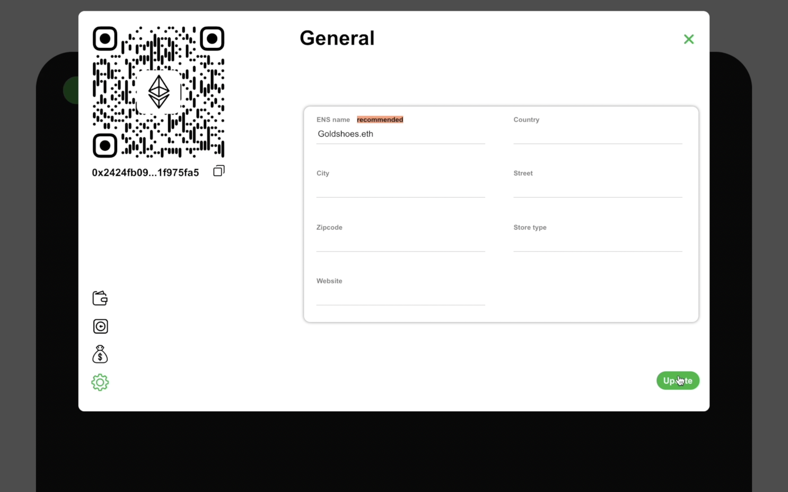

# Deploy, Stake, and Collect

This page is for users who are selling their goods and services and don't wish to give discounts. We will provide steps helping you setting a store to better help your customers.

### Step1

Make sure you are in the manage section of the application and click the deploy button.

###

### Step2

Once the store is deployed, we can hover over the store and observe that the available funds, collateral, stake, and collateral relief are all zero. We can proceed to click on the store. 

