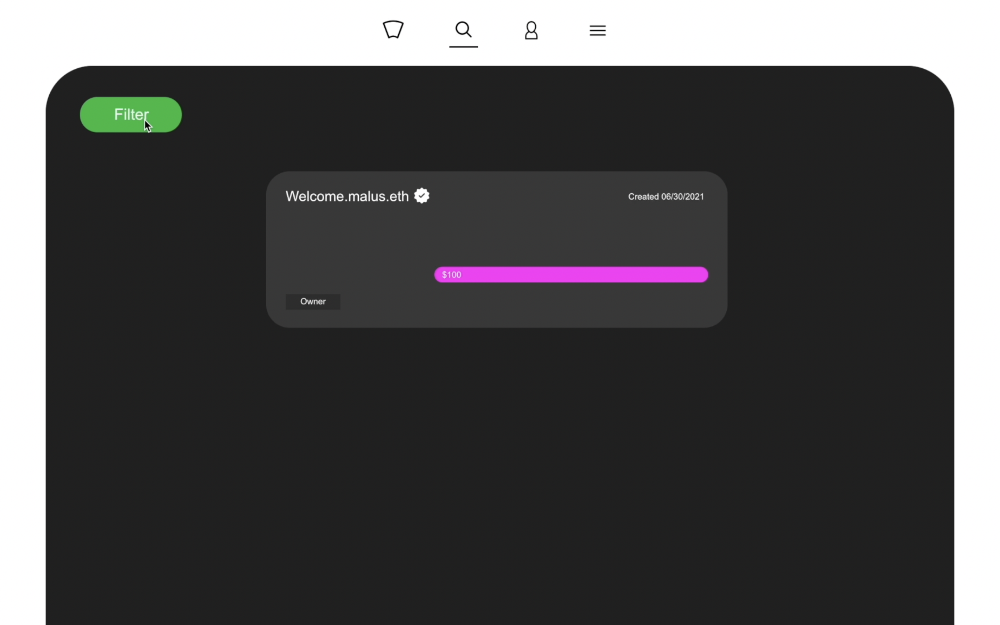
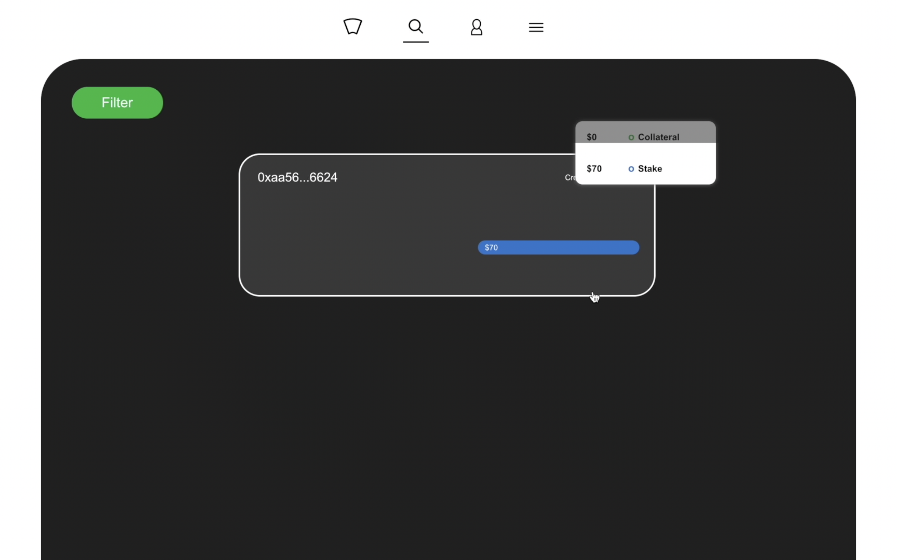
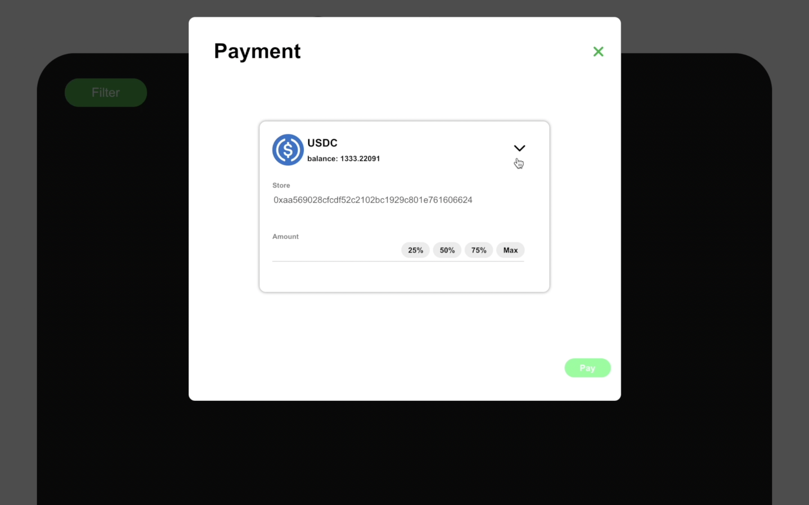
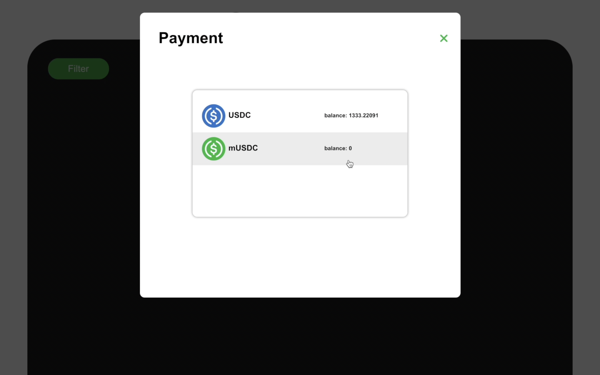
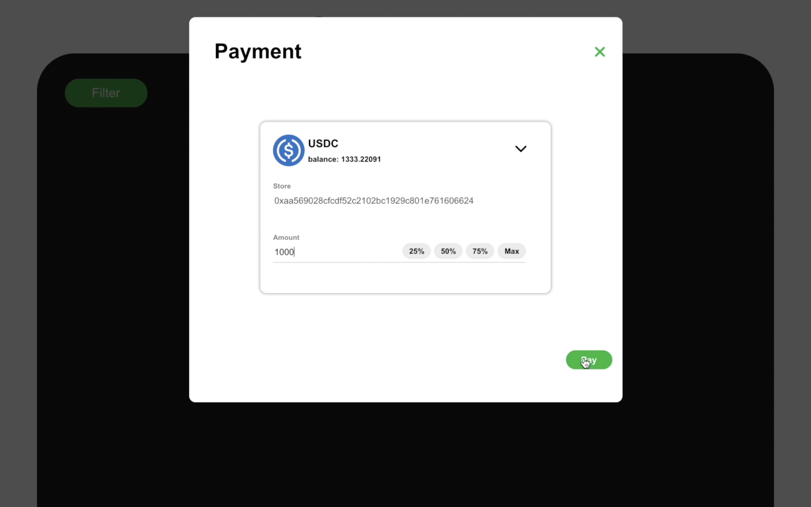
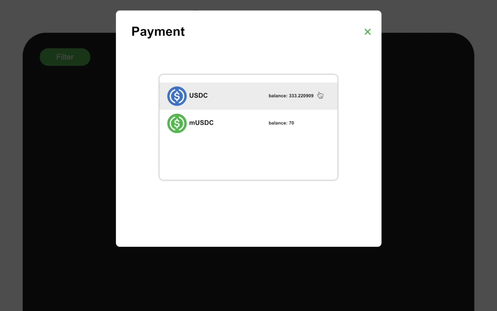
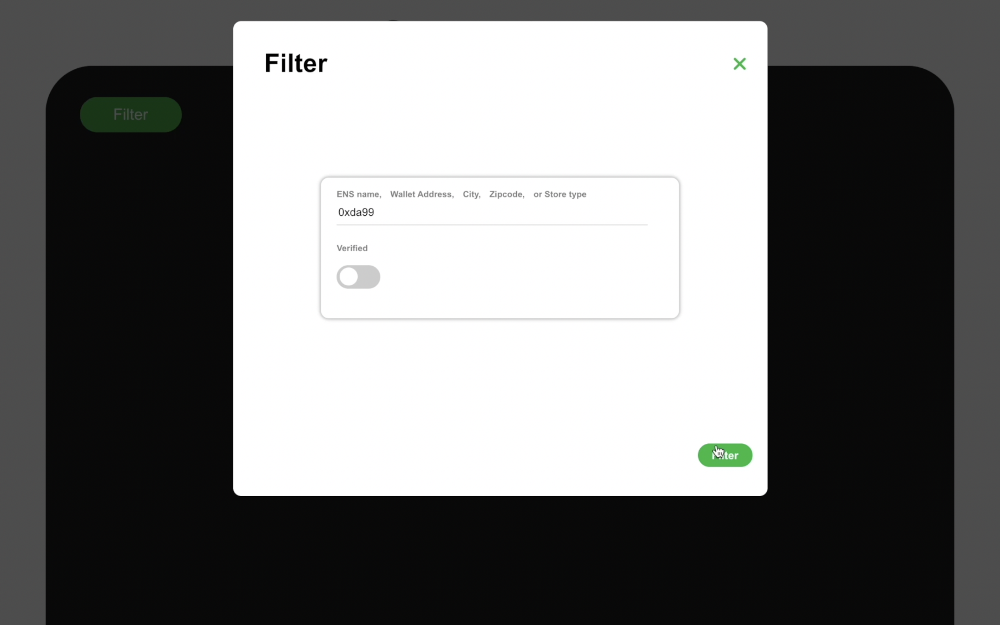
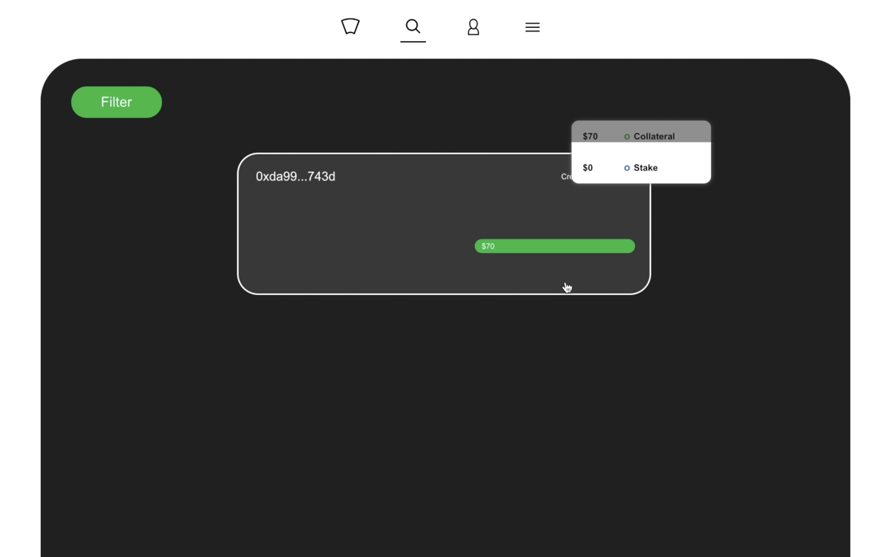
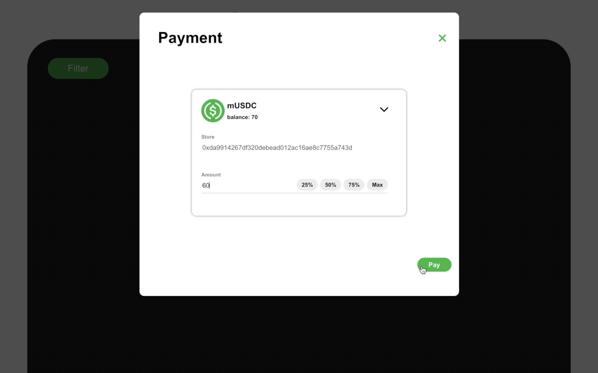

# Filter and Pay

Before we are able pay, we first need to filter for the store we want to send our payment. We are able to filter by ENS name, Wallet Address, City, Zip code, or Store type. 

### 

### Step1

Make sure you are in the discover section of the application and click the filter button.

### 

### Step2

In this example, we are going to filter by wallet address. There is no need to write out the entire wallet address only the first few characters is enough. 

### 

### Step3

Once we filter for the store, we can proceed to click on the store. In addition, we can observe the available stake and collateral when we hover over the store. 

### 

### Step4

\(Optional\) Before paying, we are going to check to see your available balances. 

### 

### Step5

While checking our balances, we can see we have 1333.22 USDC and 0 mUSDC. 

### 

### Step6

We can now proceed to pay with 1000 USDC. 

### 

### Step7

Checking our balances again, we now have 333.22 USDC and 70 mUSDC. 

### 

### Step8

We will filter by another wallet address to perform one last payment.

### 

### Step9

We can proceed to click on the store. Notice that there is no stake in this store only 70 collateral.

### 

### Step10

Since there is no stake in this store, we will be paying 60 mUSDC. 

