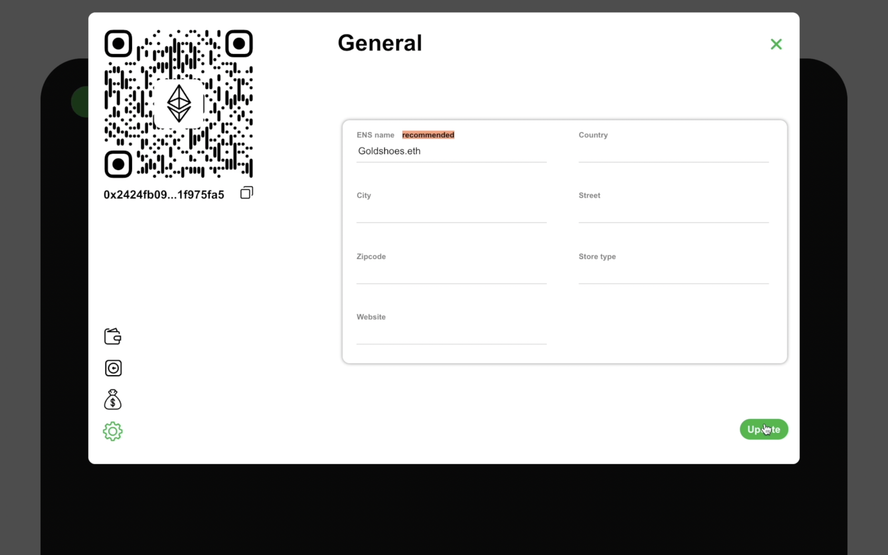
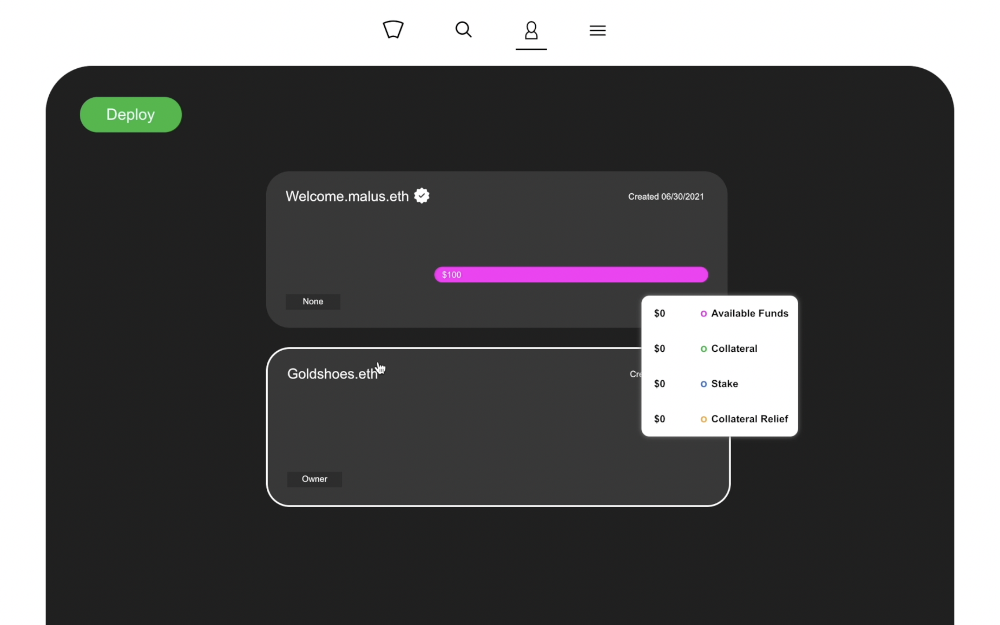

# Naming Stores and Description

When running your business, it is recommended to have one dedicated store so users can find your business. You can use information such as an ENS name and other descriptive information. 


We will only cover how to add an ENS name since all other fields are straight forward to fill in. 


### Step1

Make sure you are in the manage section of the application and click on the store you want to name.

.png>)

### Step2

Once your store is open, you can just type the ENS name in the correct field and click on update.


Please note that the ENS name must resolve to the wallet address of the store to be successful. You can resolve the name by copying the wallet address and resolve it at [https://ens.domains/](https://ens.domains)


### Step3

When the transaction is completed, we can close the store and observe that the name is officially changed.

